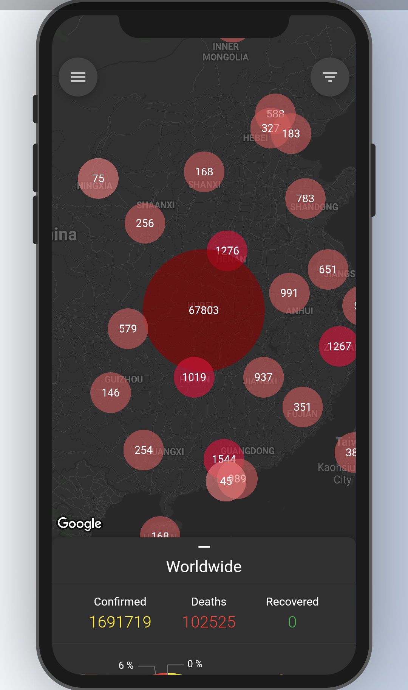
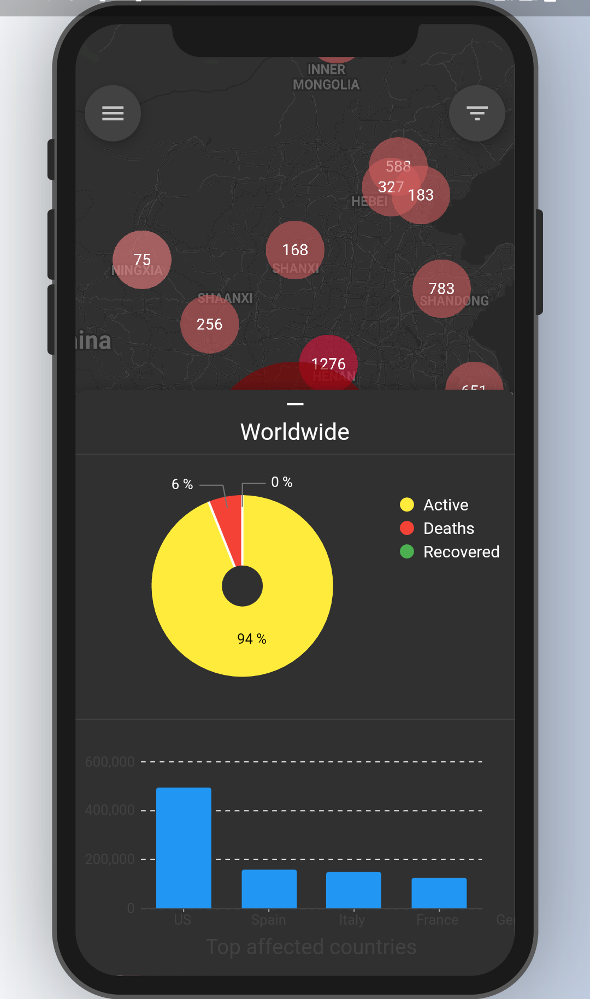
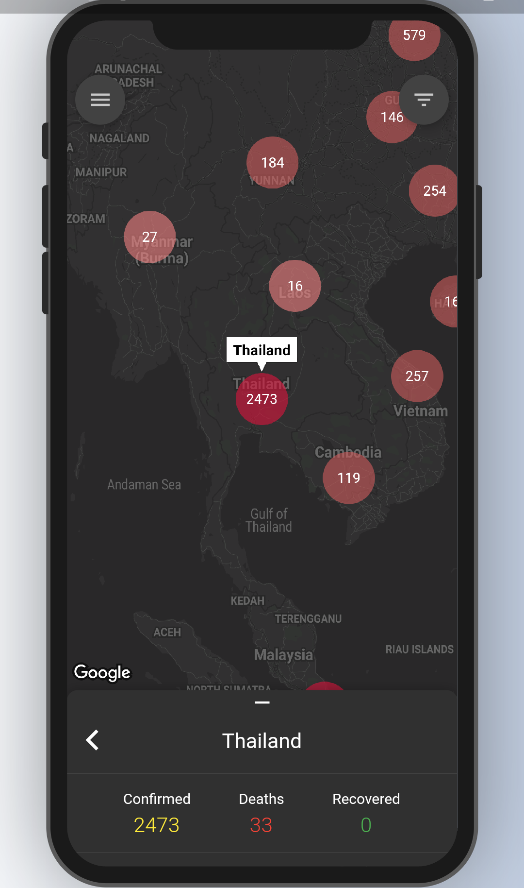
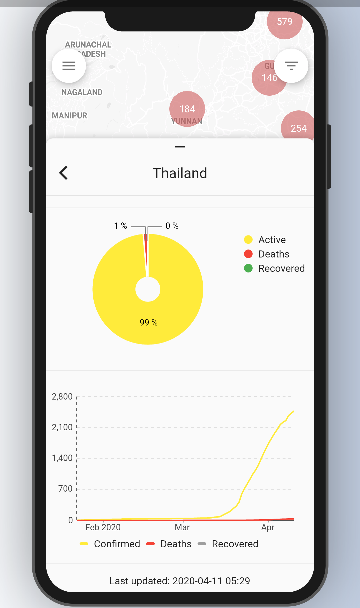
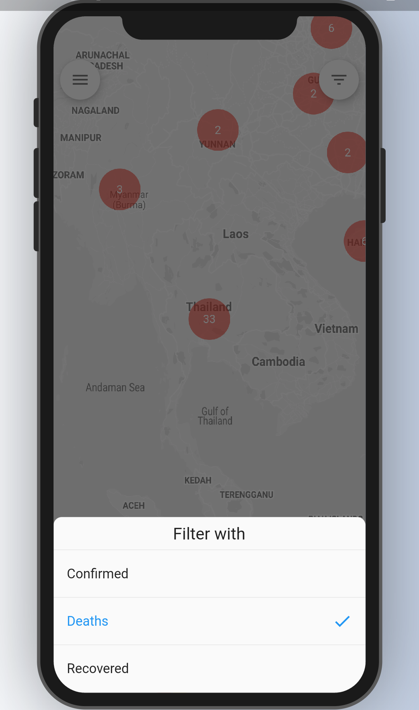

# Corona Tracker

Corona virus tracker app for IOS and Android.

 |  |  |  |  
--- | --- | --- | --- |---

## Recovered cases showing 0 [see](https://github.com/CSSEGISandData/COVID-19/issues/1250)

## Features
- Coronavirus map
- Charts:
    * Current state chart for all countries (and cities).
    * Timeline chart.
    * Top affected countries chart.
- Languages
    |Language|Code||
    |---|---|---|
    |Tiếng việt (Vietnamese)|vi| :heavy_check_mark:|
    |Tiếng Anh (English)|en|:heavy_check_mark:  |

### Data
Data is provided by ExpDev (https://github.com/ExpDev07/coronavirus-tracker-api).
